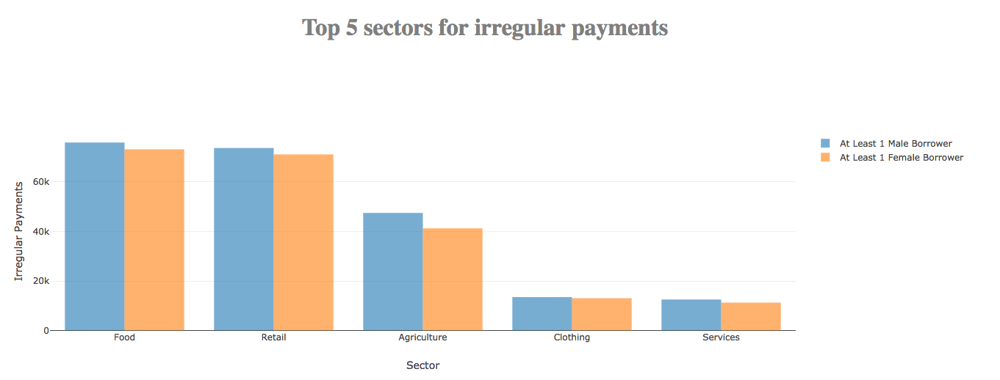
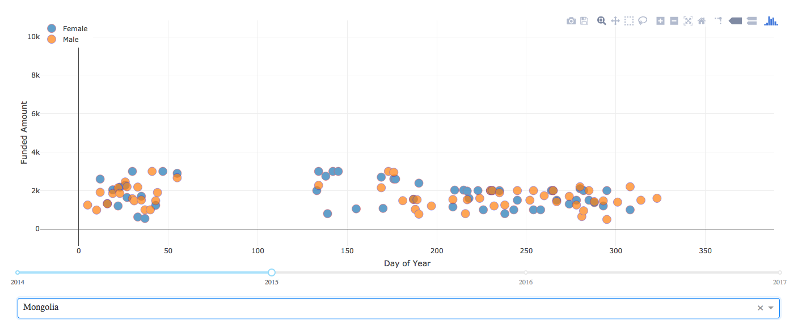
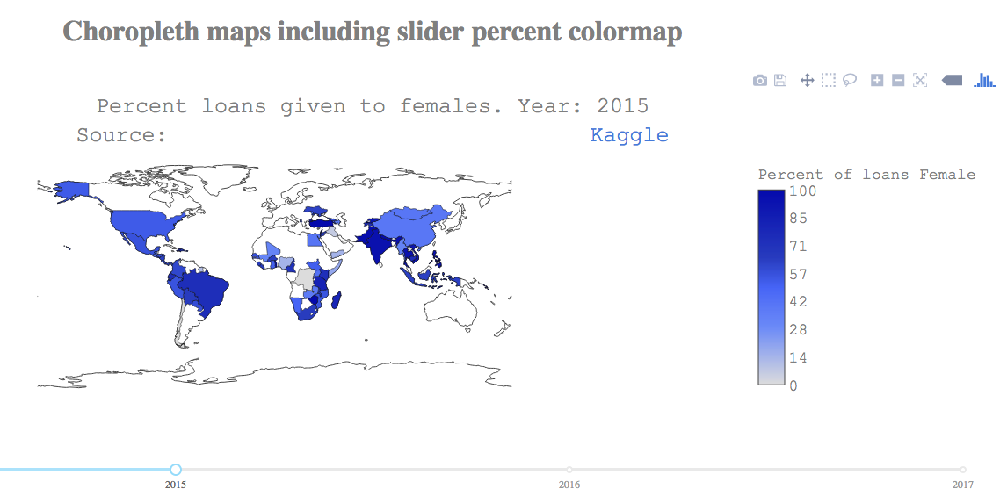

# kiva-plotly-dash-demo

# Canvas submission expectations
* Functioning Dash code.
* A screenshot of your Dash.
* A file with a list of team members, questions you chose to answer with your visualizations.
* 2-3 different types of graphs per group.
* Turn in by Friday of next week, after midterms.

# Details

**Team members:**     
David, Fanny, Mike, Noah, and Adriana   

**Description:**    
We will include the questions and brief sentences about our visualizations in this README. The app can be found above, it is named `app.py`. For brevity, below is a screenshot of our app. We made several different graphs. David worked on the choropleth; Fanny, and Mike worked on comparing gender and loans; Noah and Adriana created the bar graph. 

# Screenshots  

### Top 5 Sectors for Irregular Payments by Gender  
  

## Fund Amounts Over Time by Gender  
  

## Percent Loans Awarded to Females by Country  
  

# Bar graph    
We were interested in the characteristics of irregular payments. Perhaps there is a differnce between irregular payments between male and females borrowers. Note that food and retail are among the highest sectors with the highest quantity of irregular payments. Aside from the agricultural sector, there was not a significant difference between aggregate irregular payment totals between male and female borrowers.  

# Scatterplot  
This interactive graph allows users to explore fund amounts in several dimensions. You can select the:  
* country of interest (ie. Mongolia, Saudia Arabia, Mali, etc.)    
* the year of interest (years between 2014 and 2017)   

In our screenshot for Mongolia, note how the funded amounts consistently rank between 0 and 4k throught the years with data (2014 and 2015). This interactive scatterplot allows us to see large disparities between male and female loans throughout the years. For example: in India, there are significantly less orange dots compared to blue dots. This means there are comparatively more loans made to females than loans made to males throught the years.    

# Map  
The choropoleth map allows us to see which regions or countries disproportionately offer loans to females compared to males. We are able to confirm previous observations that India makes more loans to females than males.  

# Resources
Dash repositories from last week's lecture:
https://github.com/crypdick/simple-plotly-dash-demo
(remember to look at the different feature branches)

https://github.com/crypdick/gdp-lifeexpectancy-dashboard

Dash gallery:
https://dash.plot.ly/gallery

Kiva site:
https://www.kiva.org/portfolio

Kiva data:
https://www.kaggle.com/kiva/data-science-for-good-kiva-crowdfunding

General Pandas cheatsheet:
https://github.com/pandas-dev/pandas/raw/master/doc/cheatsheet/Pandas_Cheat_Sheet.pdf

Pandas Group operations:
https://chrisalbon.com/python/data_wrangling/pandas_apply_operations_to_groups/

Plotly Python chart examples:
https://plot.ly/python/
    - particularly interesting: https://plot.ly/python/#statistics

Plotly Python cheatsheet:
https://images.plot.ly/plotly-documentation/images/python_cheat_sheet.pdf

Plotly Python full reference:
https://plot.ly/python/reference/

Intro to Animations:
https://plot.ly/python/animations/

Dash guide:
https://dash.plot.ly/

In particular, look at the core components and html components for many options.

Stuck?
Use help() and put in any plotly object and it will give you all the documentation.
